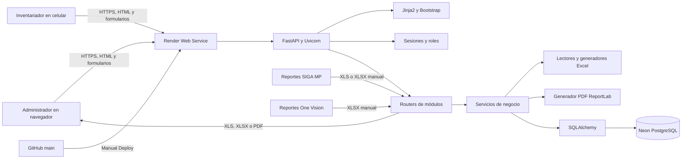
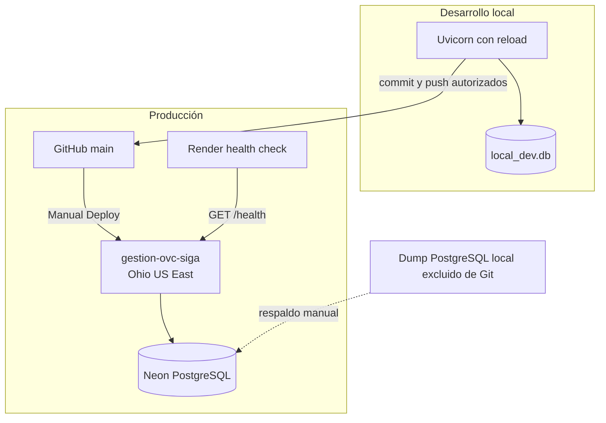
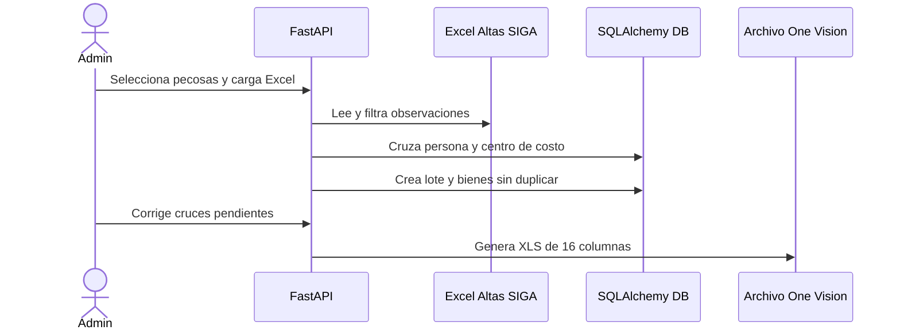
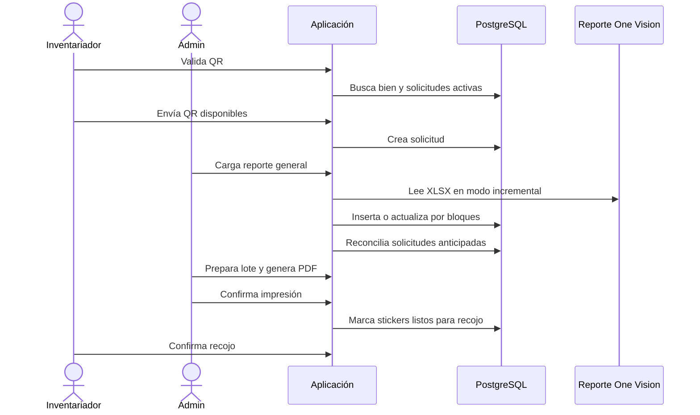
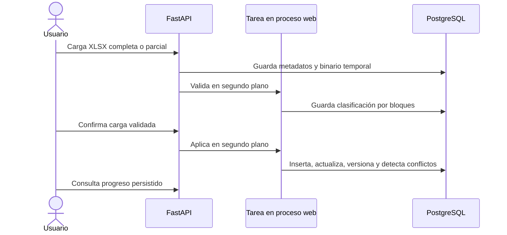

# Arquitectura de Gestión QR

## 1. Vista general

Gestión QR es un monolito web renderizado en servidor. FastAPI expone páginas HTML y endpoints de formulario, Jinja2 genera la interfaz y SQLAlchemy centraliza la persistencia. Los archivos de SIGA MP y One Vision ingresan por carga manual y los archivos de salida se generan en el mismo proceso web.

No hay frontend separado, cola externa, almacenamiento de objetos ni API de terceros. En local se usa SQLite. En producción se usa PostgreSQL de Neon y la aplicación se ejecuta como Web Service en Render.

## 2. Stack técnico verificado

### Runtime y servidor

| Componente | Versión | Uso |
| --- | --- | --- |
| Python | 3.12.10 | Lenguaje y runtime. |
| FastAPI | 0.115.0 | Enrutamiento, formularios, carga de archivos y respuestas. |
| Uvicorn Standard | 0.30.6 | Servidor ASGI. |
| Starlette SessionMiddleware | Incluido por FastAPI/Starlette | Sesión firmada en cookie. |
| Jinja2 | 3.1.4 | Renderizado HTML en servidor. |
| Bootstrap | 5.3.3 por CDN | Componentes y diseño responsivo. |
| CSS propio | Sin versión | Ajustes visuales y portal móvil. |

### Datos

| Componente | Versión | Uso |
| --- | --- | --- |
| SQLAlchemy | 2.0.35 | ORM, consultas, transacciones y actualizaciones masivas. |
| SQLite | Proveedor de Python | Base local predeterminada y base de pruebas. |
| PostgreSQL | 18, administrado por Neon | Base de producción. |
| psycopg2-binary | 2.9.9 | Driver PostgreSQL. |

### Archivos y reportes

| Componente | Versión | Uso |
| --- | --- | --- |
| pandas | 2.2.2 | Lectura y transformación de reportes tabulares. |
| openpyxl | 3.1.5 | Lectura incremental y generación `.xlsx`. |
| xlrd | 2.0.1 | Lectura de `.xls` antiguos. |
| xlwt | 1.3.0 | Generación del `.xls` exigido por One Vision. |
| ReportLab | 4.4.4 | Stickers QR y fichas patrimoniales PDF. |

### Seguridad y configuración

| Componente | Versión | Uso |
| --- | --- | --- |
| passlib | 1.7.4 | Abstracción de hashing. |
| bcrypt | 4.0.1 | Hash de contraseñas. |
| itsdangerous | 2.2.0 | Firma asociada al middleware de sesión. |
| python-dotenv | 1.0.1 | Carga de `.env` en local. |
| python-multipart | 0.0.9 | Formularios y archivos multipart. |

### Infraestructura

| Componente | Uso |
| --- | --- |
| GitHub | Repositorio y origen de despliegue. |
| Render Web Service | `gestion-ovc-siga`, región Ohio (US East), despliegue manual. |
| Neon | PostgreSQL 18, región AWS US East 2 (Ohio). |

El servicio anterior de Render está suspendido. La URL productiva es `https://gestion-ovc-siga.onrender.com`.

## 3. Diagrama de componentes

## 4. Diagrama de despliegue

## 5. Capas y responsabilidades

### `app/main.py`

- registra modelos y crea tablas faltantes;
- aplica adecuaciones idempotentes de esquema e índices;
- crea el administrador inicial si no existe;
- repara universos antiguos de Control Impresión;
- reconcilia solicitudes pendientes al iniciar;
- registra routers, archivos estáticos, middleware y `/health`;
- reanuda cargas y exportaciones patrimoniales persistidas.

### `app/routers`

Los routers reciben parámetros, validan permisos, coordinan transacciones y construyen respuestas HTML, JSON o archivos. Los formularios usan el patrón POST y redirección 303 para evitar reenvío al actualizar la página.

### `app/services`

- encapsulan lectura y escritura de Excel;
- implementan cruces, normalizaciones y reconciliación;
- generan PDF;
- ejecutan importaciones por bloques;
- mantienen la lógica de estados de solicitudes.

### `app/models.py`

Define 27 tablas ORM. Hay cuatro agregados principales:

1. pecosas, altas y normalización;
2. inventario y lotes de Control Impresión;
3. solicitudes de inventariadores;
4. maestro patrimonial y auditoría.

### `app/templates` y `app/static`

Interfaz renderizada en servidor. La vista del inventariador cambia de tabla a tarjetas compactas en pantallas menores que el breakpoint `lg`. La confirmación de recojo usa un elemento HTML `<dialog>` centrado.

## 6. Flujos técnicos principales

### Normalización de pecosas

### Control Impresión y solicitudes

### Maestro Patrimonial

## 7. Decisiones de arquitectura

### ADR-001: monolito FastAPI con renderizado en servidor

**Contexto:** el sistema es interno, orientado a formularios y reportes, y debe ser mantenible por un equipo pequeño.

**Decisión:** usar un único proceso FastAPI con Jinja2, Bootstrap y SQLAlchemy.

**Alternativas consideradas:** frontend SPA con API separada; servicios independientes por módulo.

**Consecuencias:** despliegue y desarrollo simples, una sola sesión y transacción central. El proceso web también soporta cargas y generación de archivos, por lo que las tareas pesadas compiten con solicitudes HTTP y requieren control de memoria y duración.

### ADR-002: SQLite local y PostgreSQL en producción

**Contexto:** se necesitaba desarrollo local sin administrar un servidor y persistencia remota estable en producción.

**Decisión:** SQLAlchemy abstrae ambos motores. SQLite es el valor predeterminado; Neon PostgreSQL se configura con `DATABASE_URL`.

**Alternativas consideradas:** PostgreSQL también en local; SQLite también en Render.

**Consecuencias:** inicio local rápido y pruebas aisladas. Existen diferencias de concurrencia, tipos, índices y sentencias DDL, por lo que faltan pruebas automatizadas específicas de PostgreSQL.

### ADR-003: evolución de esquema durante el arranque

**Contexto:** el proyecto comenzó sin una herramienta formal de migraciones y debía actualizar bases existentes sin pasos manuales adicionales.

**Decisión:** ejecutar `create_all` y adecuaciones `ALTER TABLE`, `CREATE INDEX` y normalizaciones desde `app.main`.

**Alternativas consideradas:** Alembic; scripts SQL manuales versionados.

**Consecuencias:** los cambios actuales son idempotentes y se aplican al iniciar. La importación de `app.main` tiene efectos sobre la base, los downgrades no están definidos y varios procesos arrancando a la vez podrían competir. Migrar a Alembic es deuda técnica prioritaria.

### ADR-004: intercambio mediante Excel, no integración directa

**Contexto:** SIGA MP y One Vision entregan reportes y formatos de importación, pero no se definió una API disponible para el proyecto.

**Decisión:** aceptar `.xls` y `.xlsx`, validar columnas y producir `.xls`, `.xlsx` y PDF.

**Alternativas consideradas:** integración por API; acceso directo a las bases externas.

**Consecuencias:** el flujo se adapta al trabajo operativo existente y mantiene control humano. Depende de encabezados y formatos externos, y requiere cargas manuales periódicas.

### ADR-005: lectura incremental y operaciones masivas

**Contexto:** los reportes contienen alrededor de 39 mil bienes y las primeras implementaciones eran lentas en producción por latencia entre Render y Neon y por actualizaciones fila por fila.

**Decisión:** usar `openpyxl` en modo `read_only`, procesar Maestro Patrimonial en bloques de 750, Control Impresión en bloques de hasta 1000 y aplicar mapeos masivos por ID.

**Alternativas consideradas:** ORM fila por fila; cargar el libro completo con pandas en todos los módulos; tabla temporal PostgreSQL con `COPY` y `MERGE`.

**Consecuencias:** la carga se redujo a minutos en los casos observados y mantiene compatibilidad con SQLite. Una tabla temporal con operaciones SQL de conjunto sigue siendo una optimización futura posible, especialmente para importaciones crecientes.

### ADR-006: Control Impresión acumulativo

**Contexto:** cada reporte general de One Vision puede ser completo o contener actualizaciones, y el historial de lotes e impresiones no debe perderse.

**Decisión:** insertar bienes nuevos, actualizar solo registros cambiados, contar los que no cambian y no desactivar bienes ausentes. Todo bien previamente inactivo se reactiva durante la importación.

**Alternativas consideradas:** reemplazo completo del inventario en cada carga; marcar ausentes como inactivos.

**Consecuencias:** cargas parciales no borran el universo ni el historial. Un bien retirado del origen no desaparece automáticamente. Si se necesita baja o desactivación real, debe diseñarse un flujo explícito.

### ADR-007: solicitudes anticipadas persistidas

**Contexto:** el inventariador puede leer un QR antes de que el bien aparezca en el reporte actualizado de One Vision.

**Decisión:** guardar el item como `Pendiente de sincronización` y reconciliarlo después de cada carga y al iniciar la aplicación.

**Alternativas consideradas:** rechazar el QR no encontrado; crear manualmente el bien.

**Consecuencias:** el inventariador no debe reenviar el QR. El estado se resuelve con una carga posterior. Solicitudes activas impiden crear otra solicitud del mismo QR.

### ADR-008: área obligatoria solo para sede administrativa DIRESA

**Contexto:** los establecimientos y redes no usan áreas específicas para el sticker, pero la sede `DIRESA - CAJAMARCA` sí.

**Decisión:** en Control Impresión, exigir área para la coincidencia normalizada exacta `DIRESA - CAJAMARCA`, bloquear impresión y mostrar el área en el sticker. Fuera de esa sede, el área es opcional y se muestra establecimiento. El módulo histórico Impresión QR no cambia esta lógica.

**Alternativas consideradas:** exigir área para todos; solo alertar y permitir impresión; modificar ambos módulos.

**Consecuencias:** las solicitudes sin área quedan esperando actualización y se reevalúan al cargar un reporte nuevo. La regla depende del texto del establecimiento y debe actualizarse si cambia el nombre institucional.

### ADR-009: PDF propio y Excel compatible con BarTender

**Contexto:** se necesitaba imprimir en una Argox iX4-250 y conservar un camino alternativo mediante BarTender.

**Decisión:** generar PDF con ReportLab usando un perfil persistido y ofrecer Excel con hojas `BarTender` y `Control`.

**Alternativas consideradas:** solo BarTender; impresión directa del navegador; ZPL o comandos nativos.

**Consecuencias:** la aplicación controla la geometría y valida legibilidad, pero no controla el driver ni la calibración física. La orientación y dos posiciones por página están adaptadas al comportamiento observado del controlador Argox.

### ADR-010: auditoría de Maestro Patrimonial

**Contexto:** una actualización SIGA no debe borrar silenciosamente una corrección manual vigente.

**Decisión:** separar el último valor importado de SIGA, el valor efectivo, las versiones, los cambios, las correcciones manuales y los conflictos.

**Alternativas consideradas:** sobrescribir siempre con el último reporte; mantener solo un log textual.

**Consecuencias:** cada cambio relevante es rastreable y el usuario decide entre SIGA y la corrección manual. El esquema y la aplicación son más complejos y requieren limpieza controlada del historial si el volumen crece mucho.

### ADR-011: tareas patrimoniales dentro del proceso web

**Contexto:** la validación, confirmación y exportación patrimonial pueden tardar más que una respuesta HTTP normal.

**Decisión:** usar `BackgroundTasks` y estados persistidos. Al iniciar, se reanudan tareas `Validando`, `Procesando` o exportaciones pendientes mediante hilos daemon.

**Alternativas consideradas:** Celery, RQ o un Render Background Worker; procesamiento síncrono.

**Consecuencias:** no se requiere infraestructura adicional y una interrupción puede retomarse. No existe garantía de ejecución exclusiva distribuida ni cola durable externa. Escalar a varias instancias requiere bloqueo o un worker real.

### ADR-012: autenticación por sesión y dos roles

**Contexto:** el administrador opera todos los módulos y el inventariador requiere una interfaz mínima desde celular.

**Decisión:** almacenar cuentas en base, usar bcrypt, guardar identidad y rol en la sesión y redirigir al inventariador fuera de cualquier ruta que no comience por `/inventariador`.

**Alternativas consideradas:** un único usuario global; proveedor de identidad externo; permisos por módulo.

**Consecuencias:** administración sencilla y separación clara del portal móvil. No hay recuperación de contraseña, segundo factor ni permisos granulares.

## 8. Rendimiento y consistencia

- PostgreSQL usa `pool_pre_ping=True` y recicla conexiones a los 240 segundos.
- Control Impresión busca por prefijo en código patrimonial y QR; busca descripción por contenido cuando hay al menos tres caracteres.
- El Maestro Patrimonial crea índices convencionales y, si PostgreSQL lo permite, habilita `pg_trgm` e índices GIN para búsquedas parciales.
- Cada lote de Control Impresión está limitado a 1000 bienes. Una selección mayor se divide automáticamente en varios lotes registrados por separado.
- Las solicitudes están limitadas a 500 QR.
- La importación de Control Impresión deduplica en memoria antes de escribir.
- La confirmación patrimonial usa una transacción para aplicar la carga. Si falla, revierte y marca `Interrumpida`.
- El progreso de confirmación solo se publica desde una segunda sesión en PostgreSQL. En SQLite se omite para evitar bloqueo.

## 9. Límites arquitectónicos conocidos

- No existe Alembic.
- Las tareas de fondo comparten el proceso web.
- La suite automatizada usa SQLite, no PostgreSQL.
- Bootstrap se carga desde CDN.
- No hay almacenamiento de objetos para archivos exportados. Las exportaciones patrimoniales se guardan como binario en PostgreSQL.
- Control General calcula parte de sus datos en Python y puede requerir optimización si crecen mucho las tablas.
- La vista `sql/vista_bartender.sql` menciona Railway y representa el flujo histórico de `bienes_alta`; no documenta el nuevo agregado de Control Impresión.
- `datetime.utcnow()` y algunos usos de `Query.get()` generan advertencias de deprecación con las versiones actuales.
