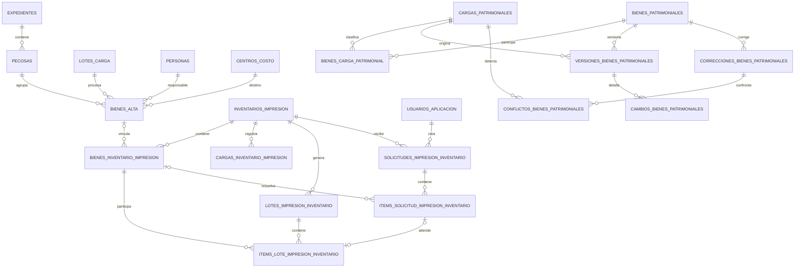

# Modelo de datos

## 1. Convenciones

- ORM: SQLAlchemy 2.0.
- Desarrollo y pruebas: SQLite.
- Producción: PostgreSQL en Neon.
- Las fechas y horas se guardan como `DateTime` sin zona horaria explícita y se generan actualmente con `datetime.utcnow()`.
- Los indicadores booleanos se guardan como `INTEGER`: `1` significa sí o activo; `0` significa no o inactivo.
- Los campos JSON se almacenan como `TEXT`, no como tipos JSON nativos, para mantener compatibilidad entre SQLite y PostgreSQL.
- `PK` significa clave primaria.
- `FK` significa clave foránea.
- `UQ` significa restricción única.
- Los tipos indicados corresponden al modelo ORM. PostgreSQL puede materializar `DateTime` como `TIMESTAMP` y `LargeBinary` como `BYTEA`.

## 2. Mapa de relaciones



Las tablas `relacion_pecosa_items`, `verificacion_pecosas_siga`, `observaciones_control_pecosa` y `perfiles_impresion_etiquetas` son agregados de apoyo sin todas sus relaciones expresadas como FK.

## 3. Catálogos, usuarios y configuración

### 3.1 `personas`

Maestro de responsables usado para obtener el DNI por nombre completo.

| Campo | Tipo | Nulo | Significado |
| --- | --- | --- | --- |
| `id` | INTEGER, PK | No | Identificador interno. |
| `nombre_completo` | VARCHAR(200), UQ, índice | No | Nombre usado en el cruce exacto normalizado contra `nombre_completo` del reporte SIGA. |
| `dni` | VARCHAR(15) | No | Documento que One Vision exige en el formato de importación. Puede ser cadena vacía en datos históricos incompletos. |

### 3.2 `centros_costo`

Maestro de dependencias y códigos One Vision.

| Campo | Tipo | Nulo | Significado |
| --- | --- | --- | --- |
| `id` | INTEGER, PK | No | Identificador interno. |
| `nombre_depend` | VARCHAR(200), UQ, índice | No | Nombre de dependencia usado en el cruce exacto normalizado. |
| `ipress` | VARCHAR(20) | No | Código de centro de costo o IPRESS exigido por One Vision. Puede ser cadena vacía en datos históricos incompletos. |

### 3.3 `usuarios_aplicacion`

Cuentas internas de acceso.

| Campo | Tipo | Nulo | Significado |
| --- | --- | --- | --- |
| `id` | INTEGER, PK | No | Identificador de la cuenta. |
| `username` | VARCHAR(80), UQ, índice | No | Nombre de inicio de sesión, guardado con `strip` y `casefold`. |
| `nombre_completo` | VARCHAR(200) | No | Nombre visible. |
| `password_hash` | VARCHAR(255) | No | Hash bcrypt; no contiene la contraseña en texto plano. |
| `rol` | VARCHAR(30), índice | No | `Administrador` o `Inventariador`. |
| `activo` | INTEGER, índice | No | `1` permite acceso; `0` bloquea la cuenta. |
| `creado_en` | DATETIME | No | Alta de la cuenta. |
| `actualizado_en` | DATETIME | No | Última modificación de perfil, contraseña o estado. |

### 3.4 `perfiles_impresion_etiquetas`

Configuración física del PDF de stickers.

| Campo | Tipo | Nulo | Significado |
| --- | --- | --- | --- |
| `id` | INTEGER, PK | No | Identificador. |
| `nombre` | VARCHAR(100), UQ | No | Nombre del perfil. El predeterminado es `Argox iX4-250 203 dpi`. |
| `ancho_pagina_mm` | FLOAT | No | Ancho físico del material. Predeterminado 105.1 mm. |
| `ancho_etiqueta_mm` | FLOAT | No | Ancho de cada etiqueta. Predeterminado 50.8 mm. |
| `alto_etiqueta_mm` | FLOAT | No | Alto de cada etiqueta. Predeterminado 38.1 mm. |
| `margen_izquierdo_mm` | FLOAT | No | Margen izquierdo. |
| `margen_derecho_mm` | FLOAT | No | Margen derecho. |
| `separacion_central_mm` | FLOAT | No | Separación entre las dos posiciones. |
| `avance_adicional_mm` | FLOAT | No | Avance vertical adicional para calibración. |
| `desplazamiento_x_mm` | FLOAT | No | Corrección horizontal. |
| `desplazamiento_y_mm` | FLOAT | No | Corrección vertical. |
| `rotacion_contenido` | INTEGER | No | Solo `0` o `180`. |
| `anio_1` | VARCHAR(4) | No | Primer año impreso en el pie. |
| `anio_2` | VARCHAR(4) | No | Segundo año impreso en el pie. |
| `anio_marcado` | VARCHAR(4) | No | Año marcado dentro de los dos configurados. |

## 4. Pecosas, normalización y altas

### 4.1 `expedientes`

| Campo | Tipo | Nulo | Significado |
| --- | --- | --- | --- |
| `id` | INTEGER, PK | No | Identificador interno. |
| `numero` | VARCHAR(50), UQ, índice | No | Número de expediente de recepción. |
| `fecha_recepcion` | DATE | Sí | Fecha en que se registró o recibió. |

Relación: un expediente contiene muchas pecosas.

### 4.2 `pecosas`

| Campo | Tipo | Nulo | Significado |
| --- | --- | --- | --- |
| `id` | INTEGER, PK | No | Identificador interno. |
| `numero` | VARCHAR(50), UQ, índice | No | Número de pecosa. La unicidad evita doble ingreso global, sin separar por año. |
| `expediente_id` | INTEGER, FK `expedientes.id` | No | Expediente de alta o recepción. |
| `fecha_recepcion` | DATE | Sí | Fecha de recepción. |
| `estado` | VARCHAR(30) | No | Estado operativo. Valores visibles actuales: `Recibida`, `Normalizada`, `StickerGenerado`, `Firmada`. |
| `firmante` | VARCHAR(200) | Sí | Responsable que firma la pecosa. |
| `fecha_firma` | DATE | Sí | Fecha de confirmación de firma. |
| `expediente_firma` | VARCHAR(50) | Sí | Expediente con el que almacén devuelve la pecosa firmada. Es distinto del expediente de alta. |
| `creado_en` | DATETIME | Sí | Momento de creación. |

### 4.3 `lotes_carga`

Agrupa una corrida de normalización hacia One Vision.

| Campo | Tipo | Nulo | Significado |
| --- | --- | --- | --- |
| `id` | INTEGER, PK | No | Número interno del lote. En Carga Inicial puede tomar directamente el número de lote del Excel. |
| `fecha` | DATETIME | Sí | Creación del lote. |
| `anio` | VARCHAR(4) | No | Año enviado a One Vision. Puede estar vacío en lotes históricos importados. |
| `ejecutora` | VARCHAR(10) | No | Código de ejecutora. Puede estar vacío en lotes históricos importados. |
| `archivo_generado` | VARCHAR(300) | Sí | Nombre del `.xls` generado; su presencia marca el lote como generado. |
| `pecosas_solicitadas` | TEXT | Sí | Lista CSV de números de pecosa seleccionados, incluso si alguna no produjo filas. |

### 4.4 `bienes_alta`

Bienes procesados desde Altas SIGA o Carga Inicial.

| Campo | Tipo | Nulo | Significado |
| --- | --- | --- | --- |
| `id` | INTEGER, PK | No | Identificador del bien. |
| `pecosa_id` | INTEGER, FK `pecosas.id`, índice | No | Pecosa asignada actualmente. |
| `lote_id` | INTEGER, FK `lotes_carga.id`, índice | Sí | Lote de normalización. |
| `codigo_patrimonial` | VARCHAR(20), índice | No | Código de activo usado para cruces. No tiene restricción única global porque el control histórico puede contener inconsistencias. |
| `descripcion` | VARCHAR(300) | No | Descripción del bien. |
| `modelo` | VARCHAR(150) | Sí | Modelo del reporte SIGA. |
| `marca` | VARCHAR(100) | Sí | Marca. En Altas SIGA se obtiene de la columna renombrada por pandas como `nombre.2`. |
| `estado_conservacion` | VARCHAR(5) | Sí | Código o texto fuente de conservación. |
| `nro_serie` | VARCHAR(100) | Sí | Número de serie. |
| `fecha_alta` | DATETIME | Sí | Fecha de movimiento o alta. |
| `nombre_depend_siga` | VARCHAR(250) | Sí | Dependencia tal como llegó de SIGA, para trazabilidad. |
| `nombre_completo_siga` | VARCHAR(250) | Sí | Responsable tal como llegó de SIGA. |
| `persona_id` | INTEGER, FK `personas.id` | Sí | Resultado del cruce o corrección manual. |
| `centro_costo_id` | INTEGER, FK `centros_costo.id` | Sí | Resultado del cruce o corrección manual. |
| `codigo_qr` | VARCHAR(50) | Sí | QR agregado después del cruce con One Vision. |
| `ruta_qr` | VARCHAR(300) | Sí | URL codificada en el sticker. |

### 4.5 `relacion_pecosa_items`

Último reporte acumulado Relación de Pecosas. Se reemplaza completamente en cada importación.

| Campo | Tipo | Nulo | Significado |
| --- | --- | --- | --- |
| `id` | INTEGER, PK | No | Identificador. |
| `nro_pecosa` | VARCHAR(50), índice | No | Número de pecosa del reporte. |
| `ano_eje` | VARCHAR(4) | Sí | Año de ejecución, separado del número. |
| `nombre_item` | VARCHAR(300) | Sí | Ítem esperado. |
| `nombre_depend` | VARCHAR(250) | Sí | Dependencia del reporte. |
| `precio_unit` | VARCHAR(30) | Sí | Precio conservado como texto fuente. |
| `motivo_pedido` | VARCHAR(500) | Sí | Motivo de pedido. |
| `fecha_pecosa` | VARCHAR(30) | Sí | Fecha conservada como texto fuente. |
| `clasificador` | VARCHAR(50) | Sí | Clasificador presupuestal. |
| `cant_aprobada` | INTEGER | Sí | Cantidad esperada para la línea. La suma por año y pecosa es el total esperado. |

### 4.6 `verificacion_pecosas_siga`

Último reporte SIGA usado para verificar asignación y año.

| Campo | Tipo | Nulo | Significado |
| --- | --- | --- | --- |
| `id` | INTEGER, PK | No | Identificador. |
| `codigo_patrimonial` | VARCHAR(20), UQ, índice | No | Clave del bien. El importador rechaza duplicados. |
| `nro_pecosa` | VARCHAR(50), índice | Sí | Pecosa real reportada por SIGA. |
| `anio_siga` | VARCHAR(4), índice | Sí | Año extraído de `fecha_alta`. |
| `importado_en` | DATETIME | No | Momento de la importación. |

### 4.7 `observaciones_control_pecosa`

| Campo | Tipo | Nulo | Significado |
| --- | --- | --- | --- |
| `id` | INTEGER, PK | No | Identificador. |
| `ano_eje` | VARCHAR(4), índice | No | Año del reporte Relación de Pecosas. |
| `nro_pecosa` | VARCHAR(50), índice | No | Número observado. |
| `causal` | VARCHAR(100) | No | Causal permitida. |
| `sustento` | TEXT | No | Justificación obligatoria. |
| `activa` | INTEGER | No | `1` si excluye la pecosa del pendiente; `0` si fue restituida. |
| `observada_en` | DATETIME | No | Momento de observación. |
| `restituida_en` | DATETIME | Sí | Momento en que volvió al flujo. |

Restricción única: `ano_eje + nro_pecosa`.

### 4.8 `correcciones_asignacion_bienes`

Auditoría de bienes trasladados entre pecosas.

| Campo | Tipo | Nulo | Significado |
| --- | --- | --- | --- |
| `id` | INTEGER, PK | No | Identificador. |
| `bien_id` | INTEGER, FK `bienes_alta.id`, índice | No | Bien trasladado. |
| `pecosa_origen_id` | INTEGER, FK `pecosas.id` | No | Pecosa anterior. |
| `pecosa_destino_id` | INTEGER, FK `pecosas.id` | No | Pecosa nueva. |
| `motivo` | VARCHAR(500) | No | Motivo documentado. |
| `creado_en` | DATETIME | No | Momento de la corrección. |

## 5. Control Impresión

### 5.1 `inventarios_impresion`

Campaña anual y unidad ejecutora del universo de impresión.

| Campo | Tipo | Nulo | Significado |
| --- | --- | --- | --- |
| `id` | INTEGER, PK | No | Identificador. |
| `nombre` | VARCHAR(150) | No | Nombre visible generado al crear el inventario. |
| `anio` | VARCHAR(4), índice | No | Año de la campaña. |
| `unidad_ejecutora` | VARCHAR(100) | No | Unidad. Predeterminado `DIRESA`. |
| `archivo_ultimo` | VARCHAR(300) | Sí | Nombre del último reporte importado. |
| `total_registros` | INTEGER | No | Total activo actual después de la última carga. |
| `creado_en` | DATETIME | No | Creación. |
| `actualizado_en` | DATETIME | No | Última importación. |

La regla de negocio confirmada exige un solo inventario por `anio + unidad_ejecutora`. El modelo todavía no declara la restricción única compuesta, por lo que la base de datos aún no la hace cumplir ante dos creaciones concurrentes. Debe incorporarse mediante una migración controlada después de comprobar que no existan duplicados actuales.

### 5.2 `cargas_inventario_impresion`

Historial persistente de reportes cargados.

| Campo | Tipo | Nulo | Significado |
| --- | --- | --- | --- |
| `id` | INTEGER, PK | No | Identificador de carga. |
| `inventario_id` | INTEGER, FK `inventarios_impresion.id`, índice | No | Campaña afectada. |
| `archivo` | VARCHAR(300) | No | Nombre base del archivo. |
| `creado_en` | DATETIME, índice | No | Fecha de carga. |
| `filas_procesadas` | INTEGER | No | Filas válidas únicas después de omitir vacías y duplicadas. |
| `nuevos` | INTEGER | No | Bienes insertados. |
| `actualizados` | INTEGER | No | Bienes existentes cuyo valor cambió. |
| `sin_cambios` | INTEGER | No | Bienes comparados sin diferencias. |
| `activos_fijos` | INTEGER | No | Activos fijos dentro de esta carga. |
| `sobrantes` | INTEGER | No | Sobrantes dentro de esta carga. |
| `duplicados` | INTEGER | No | Filas repetidas dentro del archivo según la clave de deduplicación. |
| `omitidos` | INTEGER | No | Filas sin código patrimonial y sin QR. |
| `total_universo` | INTEGER | No | Total activo acumulado después de la carga. |
| `activos_fijos_universo` | INTEGER | No | Activos fijos acumulados. |
| `sobrantes_universo` | INTEGER | No | Sobrantes acumulados. |

### 5.3 `bienes_inventario_impresion`

Estado vigente de cada bien dentro de una campaña.

| Campo | Tipo | Nulo | Significado |
| --- | --- | --- | --- |
| `id` | INTEGER, PK | No | Identificador. |
| `inventario_id` | INTEGER, FK `inventarios_impresion.id`, índice | No | Campaña. |
| `bien_alta_id` | INTEGER, FK `bienes_alta.id`, índice | Sí | Vínculo opcional con el flujo histórico de altas. |
| `codigo_patrimonial` | VARCHAR(30), índice | Sí | Identificador de activo fijo. Es nulo para sobrantes. |
| `codigo_qr` | VARCHAR(50), índice | Sí | QR normalizado sin ceros iniciales si es numérico. |
| `tipo_bien` | VARCHAR(30), índice | No | `Activo fijo` o `Sobrante`. |
| `ruta_qr` | VARCHAR(500) | Sí | URL a codificar. |
| `descripcion` | VARCHAR(500) | No | Nombre del bien. |
| `establecimiento` | VARCHAR(300), índice | Sí | Establecimiento de One Vision. |
| `red` | VARCHAR(250), índice | Sí | Red. |
| `area` | VARCHAR(300), índice | Sí | Área. Solo es obligatoria para imprimir si el establecimiento es DIRESA. |
| `marca` | VARCHAR(150) | Sí | Marca. |
| `modelo` | VARCHAR(200) | Sí | Modelo. |
| `color` | VARCHAR(100) | Sí | Color. |
| `nro_serie` | VARCHAR(150) | Sí | Número de serie. |
| `activo` | INTEGER, índice | No | Participación en el universo vigente. La importación acumulativa actual reactiva todos los existentes y no desactiva ausentes. |
| `imprimible` | INTEGER, índice | No | Resultado de validar QR y URL. |
| `motivo_bloqueo` | VARCHAR(300) | Sí | `Sin Código QR`, `Sin Ruta QR` o `Ruta QR no válida`. |
| `estado_impresion` | VARCHAR(30), índice | No | `Pendiente`, `Bloqueado`, `Sticker generado` o `Impreso`. |
| `sticker_generado_en` | DATETIME | Sí | Última generación de PDF para el bien. |
| `impreso_en` | DATETIME, índice | Sí | Última confirmación física de impresión. |
| `relacion_alta` | VARCHAR(30) | No | `Vinculado`, `Ambiguo` o `Sin alta`. |
| `importado_en` | DATETIME | No | Primera inserción. |
| `actualizado_en` | DATETIME | No | Último cambio proveniente del reporte. |

Restricción única: `inventario_id + codigo_patrimonial`. PostgreSQL y SQLite permiten varias filas con `codigo_patrimonial = NULL`, lo que permite múltiples sobrantes. Los sobrantes se deduplican por QR durante cada archivo, pero no hay restricción única de QR en la tabla.

### 5.4 `lotes_impresion_inventario`

| Campo | Tipo | Nulo | Significado |
| --- | --- | --- | --- |
| `id` | INTEGER, PK | No | Número del lote. |
| `inventario_id` | INTEGER, FK `inventarios_impresion.id`, índice | No | Campaña. |
| `creado_en` | DATETIME | No | Preparación del lote. |
| `pdf_generado_en` | DATETIME | Sí | Momento en que se generó el PDF. |
| `estado` | VARCHAR(30), índice | No | `Preparado`, `Sticker generado`, `Impreso parcial` o `Impreso`. |
| `filtros` | TEXT | Sí | JSON textual con filtros, origen, confirmación de reimpresión y cantidad excluida. |
| `total_bienes` | INTEGER | No | Cantidad congelada al crear el lote. |

### 5.5 `items_lote_impresion_inventario`

| Campo | Tipo | Nulo | Significado |
| --- | --- | --- | --- |
| `id` | INTEGER, PK | No | Identificador del item. |
| `lote_id` | INTEGER, FK `lotes_impresion_inventario.id`, índice | No | Lote. |
| `bien_id` | INTEGER, FK `bienes_inventario_impresion.id`, índice | No | Bien. |
| `solicitud_item_id` | INTEGER, FK `items_solicitud_impresion_inventario.id`, UQ, índice | Sí | Solicitud atendida por este item. |
| `impreso_en` | DATETIME, índice | Sí | Confirmación física del item. Nulo significa pendiente. |

Restricciones: `lote_id + bien_id` único; una solicitud individual solo puede enlazarse a un item de lote.

## 6. Solicitudes de inventariadores

### 6.1 `solicitudes_impresion_inventario`

| Campo | Tipo | Nulo | Significado |
| --- | --- | --- | --- |
| `id` | INTEGER, PK | No | Número visible de solicitud. |
| `inventario_id` | INTEGER, FK `inventarios_impresion.id`, índice | No | Campaña seleccionada. |
| `usuario_id` | INTEGER, FK `usuarios_aplicacion.id`, índice | No | Inventariador creador. |
| `estado` | VARCHAR(40), índice | No | Resumen derivado de los items. |
| `creado_en` | DATETIME, índice | No | Envío. |
| `actualizado_en` | DATETIME | No | Última transición. |
| `recogido_en` | DATETIME | Sí | Fecha en que todos los items válidos quedaron recogidos. |

Estados posibles observados en código: `Pendiente`, `Pendiente con actualización`, `En lote`, `En lote con actualización`, `Esperando actualización`, `Atención parcial`, `Listo para recojo`, `Listo para recojo con observados`, `Recogido`, `Recogido con observados`, `Observado`.

### 6.2 `items_solicitud_impresion_inventario`

| Campo | Tipo | Nulo | Significado |
| --- | --- | --- | --- |
| `id` | INTEGER, PK | No | Identificador. |
| `solicitud_id` | INTEGER, FK `solicitudes_impresion_inventario.id`, índice | No | Solicitud padre. |
| `bien_id` | INTEGER, FK `bienes_inventario_impresion.id`, índice | Sí | Bien resuelto. Es nulo mientras el QR no existe o es ambiguo. |
| `codigo_qr` | VARCHAR(80), índice | No | QR solicitado, normalizado. |
| `estado` | VARCHAR(40), índice | No | Estado individual. |
| `motivo_observacion` | VARCHAR(300) | Sí | Explicación visible. También se usa para estados de espera. |
| `es_reimpresion` | INTEGER | No | `1` cuando se confirmó que un bien ya impreso debe imprimirse de nuevo. |
| `listo_recojo_en` | DATETIME | Sí | Momento en que Patrimonio confirmó impresión. |
| `recogido_en` | DATETIME | Sí | Confirmación del inventariador. |
| `creado_en` | DATETIME | No | Alta del item. |

Restricción única: `solicitud_id + codigo_qr`. La prevención entre solicitudes activas se implementa en lógica de aplicación, no con una restricción parcial de base.

Estados individuales: `Pendiente`, `En lote`, `Listo para recojo`, `Recogido`, `Observado`, `Pendiente de sincronización`, `Pendiente de actualización de área`.

## 7. Maestro Patrimonial y auditoría

### 7.1 `cargas_patrimoniales`

| Campo | Tipo | Nulo | Significado |
| --- | --- | --- | --- |
| `id` | INTEGER, PK | No | Número de carga. |
| `nombre_archivo` | VARCHAR(300) | No | Nombre base del reporte. |
| `huella_archivo` | VARCHAR(64), índice | No | SHA-256 para detectar el mismo archivo. |
| `usuario_carga` | VARCHAR(100) | No | Usuario de sesión que inició la carga. |
| `creado_en` | DATETIME, índice | No | Creación. |
| `confirmado_en` | DATETIME | Sí | Aplicación final. |
| `estado` | VARCHAR(30), índice | No | `Validando`, `Lista para confirmar`, `Procesando`, `Completada`, `Rechazada`, `Cancelada` o `Interrumpida`. |
| `tipo_carga` | VARCHAR(20), índice | No | `Completa` o `Parcial`. |
| `progreso` | INTEGER | No | Porcentaje informativo 0 a 100. |
| `mensaje_progreso` | VARCHAR(300) | Sí | Descripción del paso actual. |
| `archivo_contenido` | BLOB o BYTEA | Sí | Copia temporal persistida para reanudar validación. Se limpia al finalizar. |
| `total_filas` | INTEGER | No | Filas no vacías leídas. |
| `filas_validas` | INTEGER | No | Filas convertidas sin error. |
| `total_errores` | INTEGER | No | Errores bloqueantes. |
| `total_alertas` | INTEGER | No | Alertas no bloqueantes, actualmente QR repetidos. |
| `total_nuevos` | INTEGER | No | Clasificados como nuevos. |
| `total_actualizados` | INTEGER | No | Clasificados con diferencias. |
| `total_sin_cambios` | INTEGER | No | Clasificados sin diferencia. |
| `total_no_incluidos` | INTEGER | No | Bienes existentes ausentes en una carga completa. |
| `detalle_validacion` | TEXT | Sí | JSON de hasta 250 errores o eventos de proceso. |
| `detalle_alertas` | TEXT | Sí | JSON de alertas. |

### 7.2 `bienes_patrimoniales`

Estado vigente y última fuente SIGA de cada código patrimonial.

| Campo | Tipo | Nulo | Significado |
| --- | --- | --- | --- |
| `id` | INTEGER, PK | No | Identificador. |
| `codigo_patrimonial` | VARCHAR(50), UQ, índice | No | Clave maestra. No es editable desde la ficha. |
| `codigo_qr` | VARCHAR(80), índice | Sí | `codigo_barra` de SIGA, normalizado si es numérico. |
| `descripcion` | VARCHAR(500) | No | `descripcion`. |
| `nombre_dependencia` | VARCHAR(350), índice | No | `nombre_depend`. |
| `usuario` | VARCHAR(300), índice | No | `usuario`, distinto de `responsable` del archivo fuente. |
| `fecha_compra` | DATE | Sí | Fecha de compra. |
| `valor_compra` | NUMERIC(18,4) | No | Valor de compra. |
| `fecha_alta` | DATE | Sí | Fecha de alta. |
| `valor_inicial` | NUMERIC(18,4) | No | Valor inicial. |
| `ubicacion_fisica` | VARCHAR(350), índice | No | `ubicac_fisica`. |
| `modelo` | VARCHAR(250) | Sí | Modelo. |
| `numero_orden` | VARCHAR(100) | Sí | `nro_orden`. |
| `medidas` | VARCHAR(300) | Sí | Medidas. |
| `valor_neto` | NUMERIC(18,4) | No | `hvalor_neto`. |
| `numero_documento` | VARCHAR(150) | Sí | `nro_documento`. |
| `marca` | VARCHAR(250) | No | Primera columna fuente llamada `nombre` en la posición 26. |
| `estado_conservacion` | VARCHAR(100) | No | Segunda columna fuente llamada `nombre` en la posición 28. |
| `fecha_nea` | DATE | Sí | Fecha NEA. |
| `numero_serie` | VARCHAR(250) | Sí | `nro_serie`. |
| `color` | VARCHAR(150) | Sí | Color. |
| `caracteristicas` | TEXT | Sí | Características. |
| `observaciones` | TEXT | Sí | Observaciones. |
| `datos_importados` | TEXT | No | JSON normalizado de los 22 campos comparables del último SIGA. No incluye correcciones manuales activas. |
| `datos_fuente` | TEXT | No | JSON con las primeras 41 celdas tal como se leyeron, serializadas de forma segura. |
| `ultima_carga_id` | INTEGER, FK `cargas_patrimoniales.id`, índice | No | Última carga que presentó el bien. |
| `creado_en` | DATETIME | No | Primera incorporación. |
| `actualizado_en` | DATETIME | No | Última actualización aplicada. |

### 7.3 `bienes_carga_patrimonial`

| Campo | Tipo | Nulo | Significado |
| --- | --- | --- | --- |
| `id` | INTEGER, PK | No | Identificador. |
| `carga_id` | INTEGER, FK `cargas_patrimoniales.id`, índice | No | Carga. |
| `bien_id` | INTEGER, FK `bienes_patrimoniales.id`, índice | Sí | Bien relacionado después de confirmar. |
| `numero_fila` | INTEGER | Sí | Fila Excel. Nulo en `No incluido`. |
| `codigo_patrimonial` | VARCHAR(50), índice | No | Clave de la fila. |
| `clasificacion` | VARCHAR(30), índice | No | `Nuevo`, `Actualizado`, `Sin cambios` o `No incluido`. |
| `datos_comparables` | TEXT | Sí | JSON normalizado de campos comparables. |
| `datos_fuente` | TEXT | Sí | JSON de la fila fuente. |

Restricción única: `carga_id + codigo_patrimonial`.

### 7.4 `versiones_bienes_patrimoniales`

| Campo | Tipo | Nulo | Significado |
| --- | --- | --- | --- |
| `id` | INTEGER, PK | No | Identificador de versión. |
| `bien_id` | INTEGER, FK `bienes_patrimoniales.id`, índice | No | Bien. |
| `carga_id` | INTEGER, FK `cargas_patrimoniales.id`, índice | Sí | Carga de origen; nulo para edición manual o resolución. |
| `origen` | VARCHAR(30) | No | `Importación`, `Edición manual` o `Resolución de conflicto`. |
| `usuario` | VARCHAR(100) | No | Actor. |
| `creado_en` | DATETIME, índice | No | Momento. |
| `snapshot` | TEXT | No | JSON del estado efectivo de la versión. |

### 7.5 `cambios_bienes_patrimoniales`

| Campo | Tipo | Nulo | Significado |
| --- | --- | --- | --- |
| `id` | INTEGER, PK | No | Identificador. |
| `version_id` | INTEGER, FK `versiones_bienes_patrimoniales.id`, índice | No | Versión. |
| `campo` | VARCHAR(80) | No | Nombre interno del campo. |
| `valor_anterior` | TEXT | Sí | Valor serializado anterior. |
| `valor_nuevo` | TEXT | Sí | Valor serializado nuevo. |

### 7.6 `correcciones_bienes_patrimoniales`

| Campo | Tipo | Nulo | Significado |
| --- | --- | --- | --- |
| `id` | INTEGER, PK | No | Identificador. |
| `bien_id` | INTEGER, FK `bienes_patrimoniales.id`, índice | No | Bien. |
| `campo` | VARCHAR(80) | No | Campo corregido. |
| `valor_anterior` | TEXT | Sí | Valor efectivo anterior. |
| `valor_nuevo` | TEXT | Sí | Valor manual. |
| `motivo` | VARCHAR(500) | No | Justificación obligatoria. |
| `usuario` | VARCHAR(100) | No | Usuario que corrigió. |
| `creado_en` | DATETIME | No | Momento. |
| `activa` | INTEGER, índice | No | `1` protege el valor manual frente a futuras cargas. |
| `cerrada_en` | DATETIME | Sí | Momento en que fue reemplazada o SIGA coincidió con ella. |

### 7.7 `conflictos_bienes_patrimoniales`

| Campo | Tipo | Nulo | Significado |
| --- | --- | --- | --- |
| `id` | INTEGER, PK | No | Identificador. |
| `bien_id` | INTEGER, FK `bienes_patrimoniales.id`, índice | No | Bien. |
| `carga_id` | INTEGER, FK `cargas_patrimoniales.id`, índice | No | Carga que contradice la corrección. |
| `correccion_id` | INTEGER, FK `correcciones_bienes_patrimoniales.id` | No | Corrección protegida. |
| `campo` | VARCHAR(80) | No | Campo en conflicto. |
| `valor_siga_anterior` | TEXT | Sí | Valor SIGA previamente conocido. |
| `valor_siga_nuevo` | TEXT | Sí | Valor de la nueva carga. |
| `valor_manual` | TEXT | Sí | Valor manual vigente. |
| `estado` | VARCHAR(30), índice | No | `Pendiente`, `Corrección conservada` o `SIGA aceptado`. |
| `resuelto_por` | VARCHAR(100) | Sí | Usuario que decidió. |
| `resuelto_en` | DATETIME | Sí | Momento de resolución. |

### 7.8 `exportaciones_patrimoniales`

| Campo | Tipo | Nulo | Significado |
| --- | --- | --- | --- |
| `id` | INTEGER, PK | No | Identificador. |
| `usuario` | VARCHAR(100) | No | Solicitante. |
| `creado_en` | DATETIME, índice | No | Inicio. |
| `completado_en` | DATETIME | Sí | Fin. |
| `estado` | VARCHAR(30), índice | No | `Pendiente`, `Procesando`, `Completada` o `Error`. |
| `progreso` | INTEGER | No | Porcentaje. |
| `tipo_reporte` | VARCHAR(30) | No | Tipo de exportación solicitado. |
| `columnas` | TEXT | No | JSON de columnas elegidas. |
| `filtros` | TEXT | No | JSON de filtros. |
| `total_filas` | INTEGER | No | Filas exportadas. |
| `nombre_archivo` | VARCHAR(300) | Sí | Nombre de descarga. |
| `archivo_contenido` | BLOB o BYTEA | Sí | XLSX persistido. |
| `mensaje_error` | VARCHAR(500) | Sí | Error visible si falla. |

## 8. Origen y forma de los datos

### 8.1 Altas Institucionales SIGA

Formatos aceptados por pandas según el archivo: `.xls` o `.xlsx` donde lo permita el endpoint. Columnas obligatorias:

```text
ano_eje
sec_ejec
codigo_patrimonial
descripcion
fecha_movimto
modelo
estado_conserv
nro_serie
observaciones
nombre_depend
nombre_completo
```

Particularidades:

- SIGA no entrega una columna dedicada de pecosa en este reporte. Se extrae el primer grupo de dígitos de `observaciones`.
- La marca puede aparecer como la tercera columna repetida `nombre`; pandas la renombra `nombre.2`.
- El cruce con maestros es exacto después de convertir a mayúsculas, recortar extremos y compactar espacios.

### 8.2 Formato de importación One Vision

El sistema genera `.xls` con 16 columnas:

```text
QR
AÑO
Ejecutora
IPRESS
DNI
Codigo Patrimonial
Descripcion
Fecha de Alta
Modelo
Marca
Estado
Nro. Serie
Observaciones
Color
Observacion Analista
Caracteristicas
```

`Observaciones` recibe el número de pecosa. `Color`, `Observacion Analista` y `Caracteristicas` quedan vacíos en este flujo.

### 8.3 Reporte QR One Vision del flujo histórico

Requiere:

- `Código Patrimonial`, `Codigo Patrimonial` o `codigo_patrimonial`;
- `Código QR` o `Codigo QR`;
- `Ruta QR`, `URL` o `Ruta` es opcional en lectura, pero una etiqueta no se imprime sin URL válida.

Bug conocido del origen: el código patrimonial puede llegar con un carácter adicional o espacio inicial. El sistema extrae dígitos y toma los últimos 12 cuando existen al menos 12.

### 8.4 Reporte general de Control Impresión

Encabezados reconocidos, sin tildes ni diferencias de mayúsculas después de normalizar:

| Campo del sistema | Encabezados aceptados |
| --- | --- |
| `codigo_patrimonial` | `codigo patrimonial` |
| `codigo_qr` | `codigo qr` |
| `ruta_qr` | `ruta qr`, `ruta`, `url` |
| `descripcion` | `bien`, `descripcion` |
| `establecimiento` | `establecimiento` |
| `red` | `red` |
| `area` | `area` |
| `marca` | `marca` |
| `modelo` | `modelo` |
| `color` | `color` |
| `nro_serie` | `nr serie`, `nro serie`, `numero serie` |

Los siete primeros campos son estructuralmente obligatorios como columnas, pero sus celdas pueden llegar vacías. Una fila sin patrimonio y sin QR se omite.

### 8.5 Relación de Pecosas SIGA

Acepta `.xls` o `.xlsx`. Columnas obligatorias:

```text
ano_eje
nombre_item
nombre_depend
precio_unit
motivo_pedido
nro_pecosa
fecha_pecosa
clasificador
cant_aprobada
```

La importación reemplaza el reporte anterior. Para `.xls` se selecciona `xlrd` explícitamente por las variantes BIFF producidas por SIGA.

### 8.6 Verificación SIGA Patrimonio

Columnas obligatorias:

```text
codigo_patrimonial
nro_pecosa
fecha_alta
```

`anio_siga` se extrae de `fecha_alta`. Un código patrimonial repetido rechaza el reporte completo. Si un `.xls` no puede leerse y existe `soffice`, el servicio intenta convertirlo a `.xlsx`; en producción se recomendó cargar directamente `.xlsx`.

### 8.7 Consolidado de Carga Inicial

Columnas esenciales detectadas por variantes de nombre:

- código patrimonial;
- bien o descripción;
- pecosa;
- expediente;
- lote.

Columnas adicionales buscadas: código QR, establecimiento, marca, modelo y número de serie.

### 8.8 Maestro Patrimonial SIGA

El archivo debe ser `.xlsx` y las primeras 41 columnas deben coincidir, en orden, con:

```text
codigo_patrimonial, descripcion, nombre_sede, nombre_depend,
responsable, usuario, nombre_prov, fecha_compra, valor_compra,
fecha_alta, valor_inicial, sede, pliego, ubicac_fisica,
nombre_item, sec_ejec, tipo_modalidad, codigo_barra, modelo,
nro_orden, medidas, hvalor_neto, abrev_movimto, secuencia,
nro_documento, flag_compartido, nombre, centro_costo, nombre,
abreviatura, fecha_nea, tipo_doc_refer, sec_modelo, nro_serie,
grupo_bien, clase_bien, familia_bien, item_bien, color,
caracteristicas, observaciones
```

Mapeo efectivo:

| Posición base 0 | Fuente | Campo del sistema |
| --- | --- | --- |
| 0 | `codigo_patrimonial` | `codigo_patrimonial` |
| 1 | `descripcion` | `descripcion` |
| 3 | `nombre_depend` | `nombre_dependencia` |
| 5 | `usuario` | `usuario` |
| 7 | `fecha_compra` | `fecha_compra` |
| 8 | `valor_compra` | `valor_compra` |
| 9 | `fecha_alta` | `fecha_alta` |
| 10 | `valor_inicial` | `valor_inicial` |
| 13 | `ubicac_fisica` | `ubicacion_fisica` |
| 17 | `codigo_barra` | `codigo_qr` |
| 18 | `modelo` | `modelo` |
| 19 | `nro_orden` | `numero_orden` |
| 20 | `medidas` | `medidas` |
| 21 | `hvalor_neto` | `valor_neto` |
| 24 | `nro_documento` | `numero_documento` |
| 26 | primer `nombre` | `marca` |
| 28 | segundo `nombre` | `estado_conservacion` |
| 30 | `fecha_nea` | `fecha_nea` |
| 33 | `nro_serie` | `numero_serie` |
| 38 | `color` | `color` |
| 39 | `caracteristicas` | `caracteristicas` |
| 40 | `observaciones` | `observaciones` |

Campos opcionales: fechas de compra, alta y NEA; QR; modelo; medidas; documento; número de orden; serie; color; características; observaciones. Los demás campos mapeados son obligatorios.

## 9. Normalizaciones y bugs conocidos del origen

1. Código patrimonial de Control Impresión:
   - 11 dígitos numéricos: se completa a 12 con cero inicial.
   - 12 o más caracteres: activo fijo.
   - 8 dígitos, cero, vacío u otra longitud menor de 12 después de la regla de 11: sobrante.
   - para sobrantes, `codigo_patrimonial` se guarda nulo y el QR actúa como identificador operativo.
2. QR numérico:
   - se quitan ceros iniciales;
   - si solo contiene ceros, queda `0`;
   - un QR alfanumérico se conserva.
3. Números de Excel:
   - valores `123.0` se convierten en `123` cuando representan identificadores enteros.
4. Pecosa en Altas SIGA:
   - se extrae desde `observaciones` mediante el primer grupo de dígitos.
5. Códigos patrimoniales del reporte QR histórico:
   - se extraen los dígitos y se conservan los últimos 12.
6. Fechas patrimoniales:
   - se aceptan objetos Excel y textos `dd/mm/YYYY`, `YYYY-mm-dd`, `dd-mm-YYYY` y `mm/dd/YYYY`.
7. Decimales patrimoniales:
   - se aceptan coma o punto decimal y separadores combinados según la última posición.
8. QR repetido en Maestro Patrimonial:
   - produce alerta, no error bloqueante.
9. Código patrimonial repetido dentro del Maestro Patrimonial:
   - produce error y rechaza la carga.
10. Ausencia en carga completa patrimonial:
   - se registra como `No incluido`, pero se conserva el bien vigente.
11. Ausencia en carga parcial patrimonial:
   - no se clasifica como `No incluido`.

## 10. Adecuaciones de esquema ejecutadas al arrancar

La aplicación puede modificar bases existentes para:

- hacer nullable `bienes_inventario_impresion.codigo_patrimonial`;
- agregar `tipo_bien`;
- agregar `solicitud_item_id` e índice único;
- agregar campos de alertas, tipo, progreso y archivo binario a cargas patrimoniales;
- normalizar ceros iniciales de QR numéricos patrimoniales;
- agregar índices de bienes, pecosas, lotes, búsquedas y estados;
- agregar estados y fechas de impresión;
- agregar `pecosas_solicitadas` y `expediente_firma` en PostgreSQL;
- quitar la columna heredada `origen_lote` en PostgreSQL;
- intentar instalar `pg_trgm` y crear índices GIN.

No existe un registro formal de versión de esquema. Este comportamiento debe reemplazarse por migraciones versionadas antes de cambios estructurales mayores.
